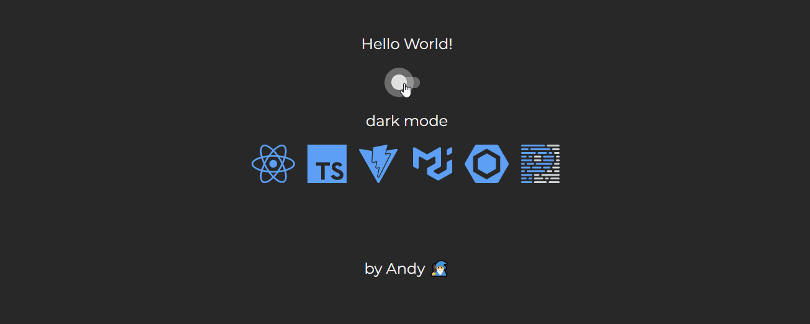

# Plantilla para comenzar un nuevo proyecto rápido 🚀

## Objetivo de la plantilla

El objetivo es **poder comenzar un nuevo proyecto de aprendizaje y diversión de forma rápida** (por eso no configuré vitest aquí, *hehe*), **contando con estándares y herramientas orientadas al mundo profesional**.

Hoy en día es bastante común poder cambiar el modo de color o tema de una aplicación, por lo que **dejé personalizado el theme de MUI, abierto a cualquier modificación**. También **implementé el cambio entre light y dark mode a través de la Context API de React, guardando la preferencia del usuario en el localStorage**. 

### Contenido
1. [Stack de herramientas utilizadas 🦾](#stack)
2. [¿Cómo utilizo la plantilla? 🤔](#how)
3. [Extensiones para Visual Studio Code ✨](#plugins)
4. [Agradecimientos 👌](#gratitude)

### Stack de herramientas utilizadas 🦾 

- Librería principal de Frontend: **React**
- Lenguajes: **TypeScript** (.ts y .tsx)
- Servidor de Desarrollo y Empaquetador: **Vite** 
- Librería de componentes UI: **Material UI** (mui)
- Análisis de código: **Eslint**
- Formateador de código: **Prettier**
- Reglas de escritura: **Airbnb**, **React**, **TypeScript**, **Prettier** y **Eslint**

### ¿Cómo utilizo la plantilla? 🤔

1. Debes forkear este repositorio o descargar el código comprimido.
2. Acceder a la carpeta donde quedó guardado en local.
3. Abrir una terminal y ejecutar el comando `npm i` para instalar las dependencias declaradas en el archivo *package.json*.
4. Para correr el proyecto solo debes ejecutar el comando `npm run dev`. Recordar que los comandos disponibles se encuentran en el archivo *package.json*, en los `"scripts"`.

### Extensiones para Visual Studio Code ✨

- Para ver los errores del eslint mientras codeas, solo instala [Error Lens](https://marketplace.visualstudio.com/items?itemName=usernamehw.errorlens).
- Si quieres formatear tu código de forma rápida (sin utilizar un comando por consola), instala la extensión de  [Prettier](https://marketplace.visualstudio.com/items?itemName=esbenp.prettier-vscode).
Para utilizarla haz click derecho en la ventana donde estás codeando y dale a la opción *Format document with* para elegir a Prettier. También la puedes dejar como tu opción por defecto.
El atajo de teclado es `shift + alt + f` para formatear el documento actual en windows.
- Si necesitas generar tonalidades (*shades*) a partir de un color en código HEX de forma mágica y sin esfuerzo, está la extensión [Tailwind Shades](https://marketplace.visualstudio.com/items?itemName=bourhaouta.tailwindshades) 🧙‍♂️✨
Solo debes seleccionar el código HEX y presionar `ctrl+k ctrl+g` en windows.

### Agradecimientos 👌 

Si te gustó la plantilla y la encontraste útil, eres libre de usarla y modificarla todo lo quieras 🤗 Si me quieres apoyar y conectar conmigo te dejo [mi perfil de LinkedIn](https://www.linkedin.com/in/andres-espinoza-delgado-fullstack-developer-typescript-react-nodejs-express-mongodb/) para una mención.
Todo feedback constructivo es bien recibido ✌   
